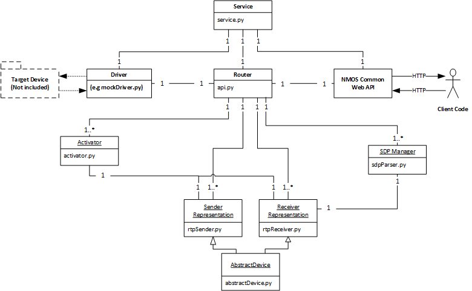

# NMOS Connection Management API Reference Implementation

## Introduction
This repository contains the reference implementation of the [NMOS Connection Management specification](https://github.com/AMWA-TV/nmos-device-connection-management), and other dependencies required to run it. 

This repo previously contained Vagrant tooling for running the API as a virtual machine. This functionality may now be found in the [NMOS Joint Reference Implementation](https://github.com/bbc/nmos-joint-ri) which demonstrates both IS-04 and IS-05 working on the same machine.

## Architecture

The reference implementation is written in Python, and is designed to be as modular as possible. The diagram below gives the rough relationships between the modules:

Each of the blocks depicted will now be examined in detail.

### Service - service.py

Service is the top level module, and is responsible for bootstrapping the rest of the program. As such it is very simple - it merely instantiates instances or the driver, the router and the web server and sets up connections between them.

### Web API

This block is an external dependency on the NMOS Common Web API class. 

It is responsible for running the HTTP server that presents the API externally, managing connections, etc. It is based on Python Flask, and much of its operation will be familiar to users of Flask. As one of its arguments it accepts an instance of the router class, which defines methods for handling requests to the server.

### Router - router.py
This block is the "top level" of the API itself, and defines the routing behaviour of the API. This is therefore a good starting point when trying to trace which sections of code are responding to calls made to the API. The driver may ask the router to invoke new sender and receiver representations, which are then made available through the API. In order to serve requests this block makes calls out to sender and receiver implementations and their associated activators and transport file managers.

### Sender and Receiver Representations
These blocks are the data representations of the senders and receivers of the API. They are responsible for the validation of requests relating to the staging of parameters, and store the current staged and active parameters associated with that sender or receiver. The Connection Management API allows for senders and receivers based on various transport mechanisms, e.g RTP or DASH. As such it is possible to have more than on implementation of these blocks, which may be used interchangeably within the same instance of the API. To ensure a consistent interface for all implementations of of the senders and receivers all implementations must be of the AbstractDevice class contained in activator.py.

At the time of writing the reference implementation only contains RTP implementations of the senders and receivers, which are contained in rtpReceiver.py and rtpSender.py respectively.

### Activator - activator.py
This block is responsible for handling any requests to the API to do with activation (e.g anything sent to a /activate endpoint). There are multiple instances of this class within the API, each assigned to either a sender and receiver. Each activator will only handle activation requests for the sender or receiver it is assigned to. In the case of immediate activations it will call the activate method on its sender or receiver immediately. In the case of a scheduled activation this class is responsible for ensuring the timing of the activation, and will call the activate method on the sender or receiver at the right time.

### Driver
The driver block is responsible for communication with the actual device/s being controlled by the API. As a vast array of different devices with different native control interfaces may be controlled by the API it is possible to have multiple implementations of the driver within the same instance of the API. The driver is responsible to alerting the router to new senders or receivers, and their initial parameters. The driver must also alert the router when senders and receivers cease to exits. Furthermore when sender and receiver parameters are activated the sender or receiver class will call a method on their corresponding driver, so that the parameters may be communicated to the device via the driver.

## Tests

Each module has a set of unit tests implemented using the Python Unit Testing Framework, and may be ran in the usual manner:

`python -m unittest discover`

Test scripts for a given module are named test<module name>.py.
